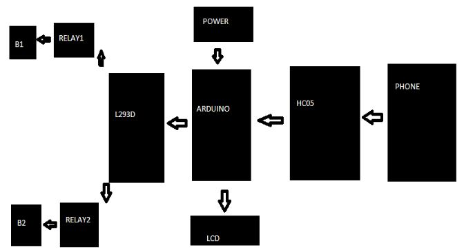

# Home-Automation-using-Hc-05
Connect Home Appliances using HC-05 Bluetooth module
Home Automation using Bluetooth and Mobile App

Technology is a never ending process. To be able to design a product using the current technology
that will be beneficial to the lives of others is a huge contribution to the community.

Generally in today’s modern world human beings are addicted to using modern equipment. 
So here we can perform home automation by using an Android App and Bluetooth as a 
wireless communication medium. Home automation not only refers to reduce human efforts 
but also energy efficiency and time saving.  Home Automation System has been designed 
using PIC 16F876A microcontroller and HC-05 bluetooth module. It can control a number of 
home appliances like lights, fans, bulbs and many more using electromechanical relay.

Required Components:
Arduino Mega (any model)
Android Phone
HC05 Bluetooth Modules
Bluetooth terminal App
L293D IC
Two 6V relays
Two bulbs
Breadboards
12 v,1A Adapter
16x2 LCD
 

<pre><b>Circuit Diagram:</b>
Circuit diagram of this Bluetooth controlled Home Automation is simple and connections can be made easily. 
LCD, Bluetooth Module HC05 and L293D Driver IC are connected to Arduino.

</pre>

Two Relays are connected to L293D to operate two AC appliances. 
Relay has total five pins, in which two pins (around the COM pin) 
are connected to L293D and GND. And COM (common) Pin is connected to 
AC mains Live terminal and NO (Normally Open) pin of Relay is connected to
one terminal of the Bulb. Other terminal of the bulb is connected to Neutral of AC mains. 

  

 

L293D driver IC is generally used to increase the current.
The Vcc2 or VS pin of L293D should be connected to VIN pin (input voltage pin or Vcc) of Arduino. 
Input 1 and Input 2 pins of IC are connected to 10 and 11 pin of Arduino and output pins are connected to relays pins.

 

<pre><b>Working Explanation:</b>
First we need to download and install the Bluetooth Terminal App in our Android Phone from the Play Store and 
then pair it with Bluetooth Module HC05 like we normally pair two Bluetooth Devices. Further check this article 
Configuring Bluetooth Terminal App for Arduino.

Now we have Bluetooth Terminal App installed in our Android phone through which we can send data to Bluetooth Module HC05. 
HC05 Bluetooth Module is connected to Arduino Mega to serially receive the data sent by Bluetooth terminal App through Android 
Smart Phone. A 16x2 LCD is used to display the On and Off status of Electronic Appliances. And L293D IC is used to drive
two Relay which are directly connected to two Bulbs. 12v Adapter is used to power the Arduino and the circuit.

Whenever we send data by Android phone, Arduino checks for the character sent and puts appropriate pins high or 
low according to Code. These pins control the relays which in turns control the Appliances. The operation of our 
project is as follows:

If we send ‘a’ through Bluetooth Terminal App then Bulb1 will be On and Bulb2 will be off.
If we send ‘b’ through Bluetooth Terminal App then Bulb2 will be On and Bulb1 will be off.
If we send ‘c’ through Bluetooth Terminal App then both the bulbs will be switched On.
If we send ‘d’ through Bluetooth Terminal App then both the bulbs will be switched Off. character ‘d’ can be used to switch 
off individual bulbs too.
You can learn here more about Arduino relay control. Check out the complete operation in Demonstration Video at the end.
</pre>
 

<pre><b>Programming Explanation:</b>
Program for this Project is very simple and can be easily understandable.

Include LiquidCrystal.h header file in your Arduino Code, it is necessary for working of LCD.

#include <LiquidCrystal.h>
LiquidCrystal lcd(7, 6, 5, 4, 3, 2);
 

Configure pin 11 and 10 as output pins of Arduino as below in void setup() function and use Serial.begin(9600) for
communication between Arduino and Android phone via Bluetooth Module HC05.

void setup() {
  pinMode(11, OUTPUT);
  pinMode(10, OUTPUT);
  Serial.begin(9600);
  lcd.begin(16, 2);
  lcd.print("**AUTOMATION**");
}
 

In void loop() function, check for the presence of any serial data and put that data in a variable char c.

void loop() {
  if (Serial.available() > 0)
  { 
    char c = Serial.read();
    if (c == 'a')
    {
     Serial.print("in a code");
     ..... .......
     ....... ......
 

Then compare that serial data (char c) with character ‘a’ ,’b’, ’c’, ’d’, which is sent by Android Smart Phone by user. After comparing, Arduino will switch on or off the Appliances according to our various conditions in our Code. You can alter the code according to your requirement. Check the full code below.
</pre>

<b>Code</b>
<pre>
#include <LiquidCrystal.h>
LiquidCrystal lcd(7, 6, 5, 4, 3, 2);

void setup() {
  pinMode(11, OUTPUT);
  pinMode(10, OUTPUT);
  Serial.begin(9600);
  lcd.begin(16, 2);
  lcd.print("**AUTOMATION**");
}

void loop() {
  if (Serial.available() > 0)
  { 
    char c = Serial.read();
    if (c == 'a')
    {
     Serial.print("in a code");
     digitalWrite(10,HIGH);
     digitalWrite(11,LOW);
     Serial.print("10 HIGH");
     lcd.clear();
     lcd.print("**BULB1 ON**");
    }
    
    if(c=='b')
    {
     digitalWrite(11,HIGH);
     digitalWrite(10,LOW);
     Serial.print("11 HIGH");
     lcd.clear();
     lcd.print("**BULB2 ON**");
    }
    
    if(c=='c')
    {
     digitalWrite(10,HIGH);
     digitalWrite(11,HIGH);
     lcd.clear();
     lcd.print("**BULB 1,2 ON**");
    }
    
    if(c=='d')
    {
     digitalWrite(10,LOW);
     digitalWrite(11,LOW);
     lcd.clear();
     lcd.print("**BULB 1,2 OFF**");
    }
  }
}
 
<pre>
